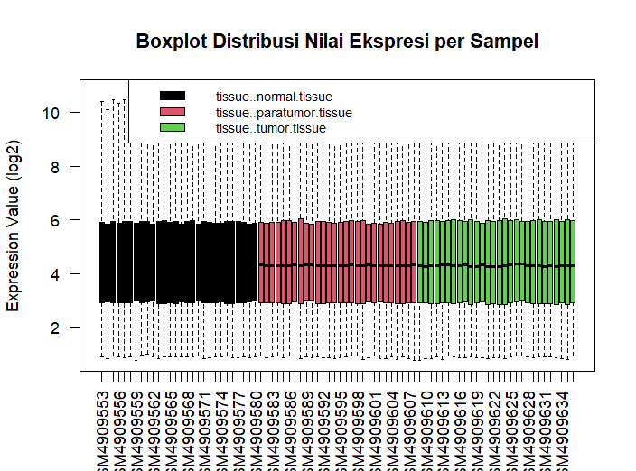

## Capstone_Project_Fauzan-Ahmad-Wijaya

**Pendahuluan**

Percobaan ini dilakukan untuk menganalisis perbedaan ekspresi gen pada data GSE 161533 milik Qiu et al. (2020). GSE ini berisi data perbandingan Esophageal Squamous Cell Carcinoma (ESCC) dengan kondisi normal serta paratumor. ESCC merupakan salah satu jenis kanker paling agresif di dunia dan sebagian besar kasus berasal dari Asia Timur, Iran Utara, Asia Tengah, dan Cina (Chen et al., 2025; Weidenbaum & Gibson, 2022). ESCC merupakan jenis paling dominan dari kanker esofagus (>90%) dengan tingkat deteksi awal rendah, keluasan genomik, resistensi pengobatan, penyebaran lokal yang cepat, dan tingkat harapan hidup 5 tahun hanya sekitar 15-25% (Chen et al., 2025; Wang et al., 2025). ESCC sendiri terjadi di bagian atas hingga tengah dari esofagus, sedangkan Esophageal Adenocarcinoma (EAC) terjadi di bagian distal serta persimpangan gastroesofagus (Weidenbaum & Gibson, 2022). Pada proyek ini dilakukan analisis DEG dengan peranti R untuk mengetahui gen-gen yang terespresikan serta relasinya dengan jalur metabolisme khususnya pada kasus ESCC.

**Metode**

Data set yang dipilih merupakan [GSE161533](https://www.ncbi.nlm.nih.gov/geo/query/acc.cgi?acc=GSE161533). Pada analisis ini, data diakses langsung menggunakan R versi 4.5.2. Pemilihan R sebagai peranti dalam analisis karena R memfasilitasi analisis serta visualisasi data yang lebih luas dan fleksibel. Sebelumnya, R Studio yang digunakan sudah terinstal BiocManager dengan sejumlah tools tambahan untuk mendukung analisis seperti GEOquery, limma, dplyr, ggplot2, pheatmap, gplots, dan RcolorBrewer.


```sh
#A: Persiapan Lingkungan Kerja

#Pemanggilan library
library(GEOquery)
library(limma)
library(umap)
library(pheatmap)
library(ggplot2)
library(dplyr)
library(illuminaHumanv4.db)
library(AnnotationDbi)
library(hgu133a.db)

#B: Pengambilan Data Dari GEO

gset <- getGEO("GSE161533", GSEMatrix = TRUE, AnnotGPL = TRUE)[[1]]
```

Setelah dataset terakser oleh R Studio, data kemudian dilakukan transformasi untuk menstabilkan varians, mendekati asumsi model linear, dan memudahkan interpretasi log fold change (skrip terlampir dalam file R). Setelah transformasi maka dilakukan pendefinisian kelompok yang pada kegiatan ini yang terdiri dari tiga kelompok yaitu normal, paratumor, dan tumor. Kelompok paratumor dan tumor dibandingkan dengan kondisi normal. Hal ini bertujuan untuk mengetahui gen yang menjadi pembatas antara tumor dengan paratumor. Paratumor sendiri merupakan gen yang secara histologi merupakan jaringan normal, tetapi berada di dekat dengan jaringan tumor (Niu et al., 2025). Sampel kemudian dibuat desain matriks yang menjadi dasar dari analisis DEG yang dijalankan lewat tools Limma. Data hasil DEG kemudian dianotasikan nama gennya sesuai dengan data resmi dari Bioconductor.

```sh
#C: Pre-Processing Data Ekspresi

ex <- exprs(gset)

qx <- as.numeric(quantile(ex, c(0, 0.25, 0.5, 0.75, 0.99, 1), na.rm = TRUE))

LogTransform <- (qx[5] > 100) || (qx[6] - qx[1] > 50 && qx[2] > 0)

if (LogTransform) {
  # Nilai <= 0 tidak boleh di-log, maka diubah menjadi NA
  ex[ex <= 0] <- NA
  ex <- log2(ex)
}


#D: Definisi Kelompok Sampel

group_info <- pData(gset)[["characteristics_ch1"]]

groups <- make.names(group_info)

gset$group <- factor(groups)

nama_grup <- levels(gset$group)
print(nama_grup)


#E: Definisi Matrix (Kerangka Statistik)

design <- model.matrix(~0 + gset$group)

colnames(design) <- levels(gset$group)

grup_normal <- nama_grup[1]
grup_paratumor <- nama_grup [2]
grup_tumor <- nama_grup[3]

contrast_formula1 <- paste(grup_paratumor, "-", grup_normal)
print(paste("Kontras yang dianalisis:", contrast_formula1))

contrast_formula2 <- paste(grup_tumor, "-", grup_normal)
print(paste("Kontras yang dianalisis:", contrast_formula2))

#lmFit():
fit <- lmFit(ex, design)

#makeContrasts(): mendefinisikan perbandingan grup normal dengan paratumor
contrast_matrix1 <- makeContrasts(contrasts = contrast_formula1, levels = design)

#contrasts.fit(): menerapkan kontras ke model grup normal dengan paratumor
fit2a <- contrasts.fit(fit, contrast_matrix1)

#makeContrasts(): mendefinisikan perbandingan grup normal dengan tumor
contrast_matrix2 <- makeContrasts(contrasts = contrast_formula2, levels = design)

#contrasts.fit(): menerapkan kontras ke model grup normal dengan tumor
fit2b <- contrasts.fit(fit, contrast_matrix2)

#eBayes():
#Empirical Bayes untuk menstabilkan estimasi varians
fit2a <- eBayes(fit2a)
fit2b <- eBayes(fit2b)

#topTable():
#Mengambil hasil akhir DEG
#adjust = "fdr" -> koreksi multiple testing
#p.value = 0.01  -> gen sangat signifikan

#grup normal dengan paratumor
topTableResults_A <- topTable(
  fit2a,
  adjust = "fdr",
  sort.by = "B",
  number = Inf,
  p.value = 0.1
)

#grup normal dengan tumor
topTableResults_B <- topTable(
  fit2b,
  adjust = "fdr",
  sort.by = "B",
  number = Inf,
  p.value = 0.1
)

head(topTableResults_A)
head(topTableResults_B)


#G:  Anotasi Nama Gen

#Pengambilan ID probe dari hasil DEG
prob_ids_A <- rownames(topTableResults_A)
prob_ids_B <- rownames(topTableResults_B)

#Mapping probe antara gene symbol dengan gene name
#Grup normal dengan paratumor
gene_annotation_A <- AnnotationDbi::select(
  hgu133a.db,
  keys = prob_ids_A,
  columns = c("SYMBOL", "GENENAME"),
  keytype = "PROBEID"
)

#Grup normal dengan tumor
gene_annotation_B <- AnnotationDbi::select(
  hgu133a.db,
  keys = prob_ids_B,
  columns = c("SYMBOL", "GENENAME"),
  keytype = "PROBEID"
)

#Penggabungan dengan hasil limma
topTableResults_A$PROBEID <- rownames(topTableResults_A)
topTableResults_B$PROBEID <- rownames(topTableResults_B)

topTableResults_A <- merge(
  topTableResults_A,
  gene_annotation_A,
  by = "PROBEID",
  all.x = TRUE
)

topTableResults_B <- merge(
  topTableResults_B,
  gene_annotation_B,
  by = "PROBEID",
  all.x = TRUE
)

#Cek hasil anotasi
head(topTableResults_A[, c("PROBEID", "SYMBOL", "GENENAME")])
head(topTableResults_B[, c("PROBEID", "SYMBOL", "GENENAME")])
```

Data hasil DEG ini kemudian divisualisasikan ke dalam sejumlah jenis plot yaitu boxplot, density plot, UMAP, Volcano Plot, dan Heatmap. Untuk analisis enrichment mencangkup Gene Ontology (GO) dan KEGG Pathway. Kedua analisis tersebut dilakukan secara online menggunakan laman terkait. 

```sh
#H.1 Boxplot Distribusi Nilai Ekspresi

group_colors <- as.numeric(gset$group)

boxplot(
  ex,
  col = group_colors,
  las = 2,
  outline = FALSE,
  main = "Boxplot Distribusi Nilai Ekspresi per Sampel",
  ylab = "Expression Value (log2)"
)

legend(
  "topright",
  legend = levels(gset$group),
  fill = unique(group_colors),
  cex = 0.8
)


#H.2 Distribusi Nilai Ekspresi (Density Plot)

expr_long <- data.frame(
  Expression = as.vector(ex),
  Group = rep(gset$group, each = nrow(ex))
)

ggplot(expr_long, aes(x= Expression, color = Group)) +
  geom_density(linewidth = 1) +
  theme_minimal() + 
  labs(
    title = "Distribusi Nilai Ekspresi Gen",
    x = "Expression Value (log2)",
    y = "Density"
  )


#H.3 UMAP

umap_input <- t(ex)

umap_result <- umap(umap_input)

umap_df <- data.frame(
  UMAP1 = umap_result$layout[, 1],
  UMAP2 = umap_result$layout[, 2],
  Group = gset$group
)

ggplot(umap_df, aes(x = UMAP1, y = UMAP2, color = Group)) +
  geom_point(size = 3, alpha = 0.8) +
  theme_minimal() +
  labs(
    title = "UMAP Plot Sampel Berdasarkan Ekspresi Gen",
    x = "UMAP 1",
    y = "UMAP 2"
  )

#I.1 Volcano Plot

#Karena gen hasil DEG antara Normal vs Paratumor hanya satu,
#maka hanya dibuat untuk Normal vs Tumor
#Definisi volcano plot 
volcano_data_B <- data.frame(
  logFC = topTableResults_B$logFC,
  adj.P.Val = topTableResults_B$adj.P.Val,
  Gene = topTableResults_B$SYMBOL
)

#Klasifikasi status gen
volcano_data_B$status <- "NO"
volcano_data_B$status[volcano_data_B$logFC > 1 & volcano_data_B$adj.P.Val < 0.01] <- "UP"
volcano_data_B$status[volcano_data_B$logFC < -1 & volcano_data_B$adj.P.Val < 0.01] <- "DOWN"

#Visualisasi
ggplot(volcano_data_B, aes(x = logFC, y = -log10(adj.P.Val), color = status)) +
  geom_point(alpha = 0.6) +
  scale_color_manual(values = c("DOWN" = "blue", "NO" = "grey", "UP" = "red")) +
  geom_vline(xintercept = c(-1, 1), linetype = "dashed") +
  geom_hline(yintercept = -log10(0.01), linetype = "dashed") +
  theme_minimal() +
  ggtitle("Volcano Plot DEG Normal dengan Tumor")


#I.2 Visualisasi Heatmap

#Karena gen hasilDEG untuk Normal vs Paratumor hanya satu,
#maka hanya akan dibuat heatmap untuk Normal vs Tumor

#Pemilihan 50 gen paling signifikan berdasarkan adj.P.Val
topTableResults_B <- topTableResults_B[
  order(topTableResults_B$adj.P.Val),
]

top50_B <- head(topTableResults_B, 50)

#Ambil matriks ekspresi untuk gen terpilih
mat_heatmap <- ex[top50_B$PROBEID, ]

#Gunakan Gene Symbol (fallback ke Probe ID)
gene_label_B <- ifelse(
  is.na(top50_B$SYMBOL) | top50_B$SYMBOL == "",
  top50_B$PROBEID,      # jika SYMBOL kosong → probe ID
  top50_B$SYMBOL        # jika ada → gene symbol
)

rownames(mat_heatmap) <- gene_label_B

#Pembersihan data (WAJIB agar tidak error hclust)
#Hapus baris dengan NA
mat_heatmap <- mat_heatmap[
  rowSums(is.na(mat_heatmap)) == 0,
]

#Hapus gen dengan varians nol
gene_variance <- apply(mat_heatmap, 1, var)
mat_heatmap <- mat_heatmap[gene_variance > 0, ]

#Anotasi kolom (kelompok sampel)
annotation_col <- data.frame(
  Group = gset$group
)

rownames(annotation_col) <- colnames(mat_heatmap)

#Visualisasi heatmap 
pheatmap(
  mat_heatmap,
  scale = "row",                 # Z-score per gen
  annotation_col = annotation_col,
  show_colnames = FALSE,         # nama sampel dimatikan
  show_rownames = TRUE,
  fontsize_row = 7,
  clustering_distance_rows = "euclidean",
  clustering_distance_cols = "euclidean",
  clustering_method = "complete",
  main = "Top 50 Differentially Expressed Genes"
)
```

```sh
#J: Menyimpan Hasil
write.csv(topTableResults_A, "Hasil_GSE161533_DEG_NormalvsParatumor.csv")
write.csv(topTableResults_B, "Hasil_GSE161533_DEG_NormalvsTumor_seluruh.csv")
write.csv(top50_B, "Hasil_GSE161533_DEG_NormalvsTumor_top50.csv")
```

**Hasil dan Interpretasi**

a.	Boxplot, Density Plot, dan UMAP Plot’

Hasil boxplot dan density plot menunjukkan pola yang kurang lebih sama yaitu nilai ekspresi yang relatif seragam. Meskipun begitu bila dperhatikan dengan saksama maka dapat dilihat bahwa ukuran jangkauan pada jaringan tumor dan paratumor sedikit lebih besar dibandingkan jangkauan distribusi pada jaringan normal. Hal ini dapat tampak lebih jelas pada density plot di ekspresi sekitar 3-5 dari log2. Hal ini mengindikasikan bahwa ada kemungkinan peralihan karakteristik pada jaringan paratumor meskipun jaringan tersebut sejatinya masih tergolong secara histologi sebagai normal.



Di sisi lain pada UMAP plot dapat terlihat jelas bahwa ekspresi gen dari jaringan para tumor memiliki lebih banyak kedekatan dengan jaringan normal. Hal ini memperkuat karakterisktik paratumor sebagai jaringan yang secar histologi masih normal. Namun tidak dipungkiri, jaringan paratumor memiliki sejumlah gen yang dekat dengan gen tumor. Selain itu dapat terlihat bahwa adanya perbedaan sebaran gen yang drastis antara gen normal dan tumor.

b. Volcano Plot

Dari analisis DEG, gen yang berbeda signifikan pada perbandingan grup normal dengan paratumor hanya penurunan dari MYOC. MYOC adalah gen yang mengkode myocilin dan gen patogen umum pada penyakit glaukoma sudut terbuka (Zhou et al., 2022). Gen ini juga ditemukan pada perbandingan antara grup normal dengan grup tumor. Di sisi lain ini sejalan dengan Niu et al. (2025) yang menunjukkan bahwa ada gen-gen di tumor terekspresi secara signifikan lebih besar dibandingkan dengan paratumor. Karena hal ini juga volcano plot hanya tersedia bagi perbandingan normal dengan tumor. Dari volcano plot tersebut dapat dilihat bahwa ada perbedaan yang kentara antara grup normal dengan tumor. Hal ini sejalan dengan sebaran gen pada UMAP plot. Jumlah gen yang terekspresikan secara signifikan lebih banyak pada golongan downregulated sedangkan golongan upregulated memiliki rentang ekspresi lebih luas.

c. Heatmap Plot

Pada heatmap plot dapat terlihat bahwa grup paratumor tetap memiliki gen yang berbeda secara ekspresi dibandigakn dengan grup normal. Meskipun begitu dapat terlihat juga bahwa perbedaan nilai ekspresi antara kedua golongan tersebut relatif rendah yang kembali memperkuat peran paratumor sebagai jarinan peralihan. Selanjutnya heatmap juga menunjukkan bahwa rentang dari gen upregulated lebih tinggi dibandingakan dengan downregulated. Pada upregulated, lebih banyak gen terekspresikan dengan nilai signifikansi yang tinggi. Hal ini sejalan dengan karakter jaringan tumor yang mengalami tingkat metabolisme dan proliferasi yang tinggi (Huang et al., 2025; Niu et al., 2025).

d. GO

Pengayaan GO menunjukan bahwa 50 gen teratas lebih banyak berhubungan dengan pengaturan kolagen dan matriks ekstraseluler. Hal ini berhubungan dengan tumor di ESCC yang memang memiliki keterkaitan dengan fibroblas. Pada ESCC terdapat perbedaan karakteristik fibroblas dan produksi kolagen yang mendorong resistensi terhadap pengobatan secara radiasi (Yang et al., 2023). Banyaknya gen yang berkaitan dengan pengaturan matriks ekstraseluler berkaitan juga dengan kinerja fibrolas dalam proses pembentukan matriks ekstraseluler.

e. KEGG

Hasil pengayaan KEGG menunjukkan kesesuaian dengan hasil GO. Hubungan yang dan nilai ekspresi yang besar dengan Rhematoid Arthritis berhubungan dengan kinerja fibroblas. Rhematoid Arthritis merupakan penyakit autoimun yang ditandai juga oleh ekspresi yang sangat tinggi dari fibroblast (Bhamidipati et al., 2026). Selain itu banyaknya keterkaitan gen-gen yang ada dengan jalur metabolisme lipid bersesuaian dengan karakteristik fisiologi ESCC. Lipid berperan penting dalam penyediaan energi, stabilitas membran, pensinyalan, dan dan pengenalan molekular pada ESCC (Jiao et al., 2024; Si et al., 2024). Hal ini memperkuat hasil GO dengan KEGG yang menunjukkan adanya banyak gen berkaitan dengan aktivitas matriks ekstraseluler. Selain itu gen yang berada pada jalur reseptor Toll-like bersesuaian dengan hasil GO mengenai Fibroblast. Reseptor Toll khususnya TLR9 memiliki keterkaitan dengan aktivitas sel fibroblas dan terekspresikan secara tinggi pada sel-sel kanker ESCC (Kauppila & Selander, 2014).

**Kesimpulan**

Dari analisis ini dapat disimpulkan bahwa adanya perbedaan signifikan pada DEG antara kondisi jaringan normal dengan jaringan tumor pada ESCC. Jaringan paratumor ESCC memiliki hasil DEG yang lebih rendah dan menunjukkan karakteristiknya yang dekat dengan jaringan normal. Di sisi lain perbedaan signifikan antara jaringan normal dengan jaringan tumor berfokus pada gen-gen yang berkaitan dengan kinerja fibroblast, jalur metabolisme lipid, reseptor toll, dan aktivitas matriks ekstraseluler.

**Referensi**

Bhamidipati, K., McIntyre, A. B. R., Kazerounian, S., Ce, G., Wong, S. W., Tran, M., Prell, S. A., Lau, R., Khedgikar, V., Altmann, C., Small, A., Madhu, R., Presti, S. R., Anufrieva, K. S., Blazar, P. E., Lange, J. K., Seifert, J. A., Donlin, L. T., Donlin, L. T., … Wei, K. (2026). Spatial patterning of fibroblast TGFβ signaling underlies treatment resistance in rheumatoid arthritis. *Nature Immunology*, *27*(March). https://doi.org/10.1038/s41590-025-02386-2

Chen, X., Zhao, Y., Wang, Y., Wang, X., Liu, Y., Liu, Z., & Li, Y. (2025). Single-cell atlas of the esophageal squamous cell carcinoma immune ecosystem to predict immunotherapy response. *Signal Transduction and Targeted Therapy*, *10*(1). https://doi.org/10.1038/s41392-025-02446-x

Huang, T., You, Q., Liu, J., Shen, X., Huang, D., Tao, X., He, Z., Wu, C., Xi, X., Yu, S., Liu, F., Wu, Z., Mao, W., & Zhu, S. (2025). WTAP Mediated m6A Modification Stabilizes PDIA3P1 and Promotes Tumor Progression Driven by Histone Lactylation in Esophageal Squamous Cell Carcinoma. *Advanced Science*, *12*(33), 1–21. https://doi.org/10.1002/advs.202506529

Jiao, R., Jiang, W., Xu, K., Luo, Q., Wang, L., & Zhao, C. (2024). Lipid metabolism analysis in esophageal cancer and associated drug discovery. *Journal of Pharmaceutical Analysis*, *14*(1), 1–15. https://doi.org/10.1016/j.jpha.2023.08.019

Kauppila, J. H., & Selander, K. S. (2014). Toll-like receptors in esophageal cancer. *Frontiers in Immunology*, *5*(MAY), 3–6. https://doi.org/10.3389/fimmu.2014.00200

Niu, L., Yang, W., Zhou, W., Duan, L., Wang, Q., Wang, X., Li, Y., Xu, C., Zhang, Y., Liu, J., Zhang, J., Fan, D., Zheng, J., & Hong, L. (2025). TGIF2-mediated HMGB3 overexpression promotes esophageal squamous cell carcinoma proliferation and metastasis through TLR3/TGF-β signaling. *Genes & Diseases*, *13*(3), 101987. https://doi.org/10.1016/j.gendis.2025.101987

Qiu, H., Li, R., Li, P., & Xing, W. (2020). *Expression data from esophageal squamous cell carcinoma patients*. GEO Publications. https://www.ncbi.nlm.nih.gov/geo/query/acc.cgi?acc=GSE161533

Si, T., Liu, D., Li, L., Xu, Z., Jiang, L., Zhai, Y., & Wu, Q. (2024). Lipid Identification of Biomarkers in Esophageal Squamous Cell Carcinoma by Lipidomic Analysis. *Nutrition and Cancer*, *76*(7), 608–618. https://doi.org/10.1080/01635581.2024.2350097

Wang, X., Jiang, J., He, H., & Wang, Y. (2025). Lactate-related gene signatures predict prognosis and immune profiles in esophageal squamous cell carcinoma. *Scientific Reports*, *15*(1), 1–18. https://doi.org/10.1038/s41598-025-10456-6

Weidenbaum, C., & Gibson, M. K. (2022). Approach to Localized Squamous Cell Cancer of the Esophagus. *Current Treatment Options in Oncology*, *23*(10), 1370–1387. https://doi.org/10.1007/s11864-022-01003-w

Yang, X., Chen, X., Zhang, S., Fan, W., Zhong, C., Liu, T., Cheng, G., Zhu, L., Liu, Q., Xi, Y., Tan, W., Lin, D., & Wu, C. (2023). Collagen 1-mediated CXCL1 secretion in tumor cells activates fibroblasts to promote radioresistance of esophageal cancer. *Cell Reports*, *42*(10), 113270. https://doi.org/10.1016/j.celrep.2023.113270

Zhou, B., Lin, X., Li, Z., Yao, Y., Yang, J., & Zhu, Y. (2022). Structure‒function‒pathogenicity analysis of C-terminal myocilin missense variants based on experiments and 3D models. *Frontiers in Genetics*, *13*(October), 1–14. https://doi.org/10.3389/fgene.2022.1019208
